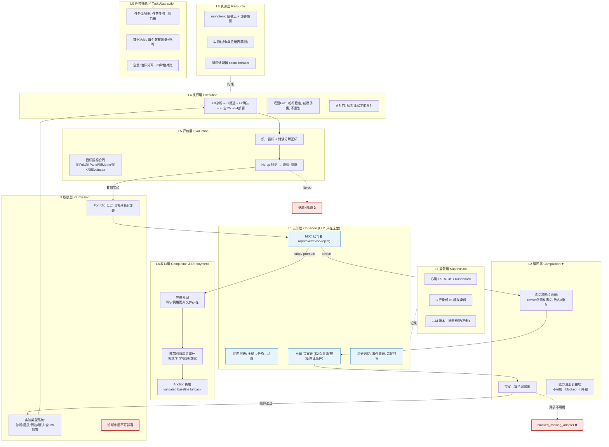

# 框架图绘画提示词（Framework Diagram Prompts）

> 三种用法：
> 1. **Mermaid 源码**（推荐）——粘到 GitHub / mermaid.live 直接渲染，精确无歧义；
> 2. **英文图像生成提示词**——喂给 GPT-4o image / Midjourney / DALL·E；
> 3. **中文图像生成提示词**——喂给即梦 / 通义万相 / 文心一格。

---

## 1. Mermaid 源码（可直接渲染）



---

## 2. 英文图像生成提示词（GPT-4o image / Midjourney / DALL·E）

```text
A clean, publication-quality software architecture diagram in flat vector
style, white background, title at top: "Self-Iterating Agent Framework (SIAF)".

The diagram shows NINE horizontal stacked layers, from bottom to top, each a
rounded rectangle band with a soft pastel fill and a bold label on the left
edge. From bottom to top:

  L0 Task Abstraction (light gray): "task adapters · data contracts with
  provenance · full-vs-sampled separation · cross-stage reconciliation"
  L1 Cognition (light blue): "problem hierarchy · LLM proposer · LLM critic ·
  research memory" — this is the ONLY layer containing LLM icons (two small
  brain/spark icons)
  L2 Compilation (light orange, marked with a star): "proposal-to-operator
  compiler · capability registry grounding · semantic genome hash"
  L3 Permission (light red): "typed experiment permissions · diagnostics can
  NEVER deploy (padlock icon) · tiered portfolio"
  L4 Execution (light green): "fidelity ladder F0 diagnostic → F1 screen →
  F2 confirm → F3 full-CV → F4 deployment · canonical folds · promotion gate"
  L5 Evaluation (light teal): "unified metrics · mutually-exclusive error
  decomposition · paired target-metric contract · no-op detector"
  L6 Resource (light yellow): "monotonic hard deadline · deployment reserve ·
  measured runtime estimates · between-fold circuit breaker"
  L7 Supervision (light purple): "live heartbeat · dashboard · append-only
  LLM ledger · forensic marking"
  L8 Completion & Deployment (dark navy, top band): "completion contract ·
  four-part deployment audit · validated-anchor fallback · terminal states"

A bold vertical arrow loop runs along the LEFT side showing the iteration
cycle with labeled steps: "problem → propose → compile → gate → genome →
execute → evaluate → portfolio → critique → next decision", curving back from
"critique" to "propose" to show self-iteration. Small red padlock icons mark
the deterministic gates (compiler, safety gate, evaluation contract,
portfolio, deployment). A dashed red arrow from the LLM critic labeled
"revise (must change semantic hash)" returns to the compiler.

On the RIGHT side, a vertical sidebar titled "Contract Stack" lists six small
chips: "Data Contract · Permission Model · Target Metric Contract · Budget
Contract · Deployment Contract · Completion Contract".

At the bottom, a one-line caption in italic: "Orchestration is not science:
every iteration must earn completion through contracts."

Typography: sans-serif, crisp, legible; generous whitespace; subtle drop
shadows; consistent 8-color pastel palette; no photographs, no 3D effects,
no gradients on text, no watermark, no decorative clutter.
Aspect ratio 4:5 (portrait), high resolution, suitable for a research paper
figure.
```

---

## 3. 中文图像生成提示词（即梦 / 通义万相 / 文心一格）

```text
一张论文级软件架构图，扁平矢量风格，纯白背景，顶部大标题：
"自我迭代智能体通用框架（SIAF）"。

画面主体为自下而上堆叠的九个圆角矩形层级带，每层左侧有粗体编号与名称，
填充柔和马卡龙色：

  最底层 L0 任务抽象层（浅灰）：任务适配器、带出处与哈希的数据合同、
        全量与抽样分离、四阶段对账
  L1 认知层（浅蓝）：问题层级（全局→分桶→机理）、LLM 提案者、LLM 批判者、
        科研记忆；全图只有这一层出现两个小脑袋/火花图标表示 LLM
  L2 编译层（浅橙，带一颗星标）：提案到算子编译器、能力注册表接地、
        语义基因组哈希
  L3 权限层（浅红）：实验类型系统、"诊断永远不可部署"（配挂锁图标）、
        分层组合（诊断/科研/部署）
  L4 执行层（浅绿）：保真度阶梯 F0诊断→F1筛选→F2确认→F3全CV→F4部署、
        规范Fold、晋升门
  L5 评价层（浅青）：统一指标、互斥错误分解、配对目标指标合同、
        无操作检测
  L6 资源层（浅黄）：单调硬截止、部署预留、实测估时、折间熔断器
  L7 监督层（浅紫）：实时心跳、仪表盘、追加只写 LLM 账本、法医标记
  最顶层 L8 收口层（深藏青）：完成合同、部署四段审计、Anchor 兜底、
        终态枚举

画面左侧有一条粗壮的纵向循环箭头，标注自我迭代步骤：
"问题→提案→编译→门禁→基因组→执行→评价→组合→批判→下一步"，
箭头从"批判"弯回"提案"，形成闭环。编译器、安全门、评价合同、组合、
部署五处各有一个红色小挂锁图标表示确定性门。另有一条红色虚线箭头从
批判者指回编译器，标注"revise（必须改变语义哈希）"。

画面右侧有一条窄侧栏，标题"合同栈"，内含六枚小胶囊标签：
数据合同、权限模型、目标指标合同、预算合同、部署合同、完成合同。

底部一行斜体小字标语：
"编排不等于科研：每一次迭代都必须凭合同赢得完成。"

字体为无衬线黑体，清晰易读，留白充足，轻微投影，整体不超过 8 种
柔和配色；不要照片元素、不要 3D 效果、不要文字渐变、不要水印、
不要装饰性杂物。竖版 4:5，高分辨率，适合作为论文插图。
```

---

## 4. 渲染后检查清单（生成图必须满足的要点）

- [ ] 九层顺序正确（L0 在底，L8 在顶）
- [ ] LLM 图标只出现在 L1 认知层（核心主张：LLM 不做裁决）
- [ ] 左侧循环箭头闭环（批判 → 提案）
- [ ] 五处挂锁：编译器 / 安全门 / 评价合同 / 组合 / 部署
- [ ] "诊断不可部署"有明确视觉表达
- [ ] 右侧合同栈六胶囊齐全
- [ ] 底部标语 "Orchestration is not science"
- [ ] 无乱码文字（图像模型常在长文字上出错——字多就改用 Mermaid 或 PPT 手绘）
